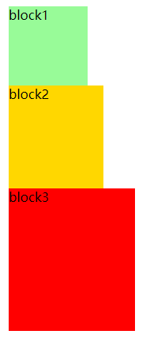
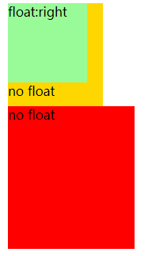
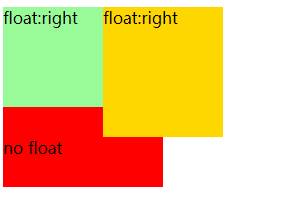
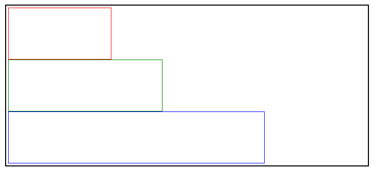
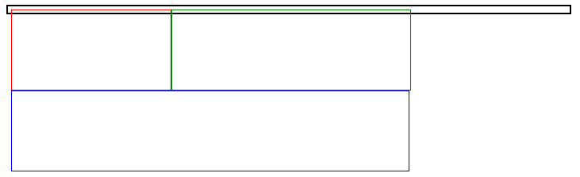
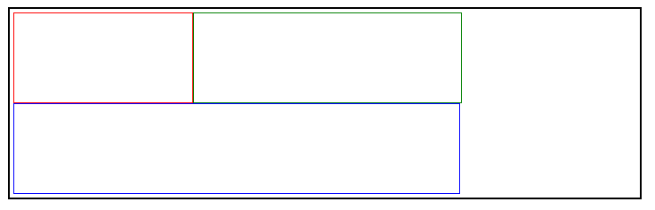
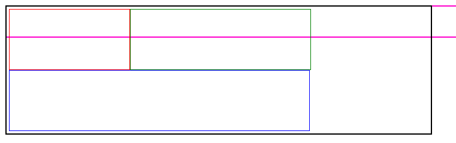
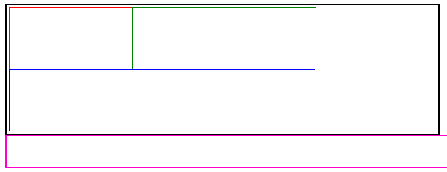

## 浮动

### 什么是浮动?

浮动就是让元素可以向左或向右移动，直到它的外边距碰到其父级的内边距或者是上一个元素的外边距(这里指的上一个元素不管它有没有设置浮动，都会紧挨着上一个元素）

**基本语法：**

```css
float : left
		right
		none
		inherit 元素从父元素中继承
```


**使用效果**

使用float前，我们假设所有的div都在文档流上

```html
## HTML5 
<div class="class1">block1</div>
<div class="class2">block2</div>
<div class="class3">block3</div>

## CSS
.class1{width:100px;height:100px;background:palegreen;}
.class2{width:120px;height:130px;background:gold;}
.class3{width:160px;height:180px;background:red;}
```



​	设置浮动后，可以发现浮动的对象位于文档流之上了，并且文字出现了环绕的效果

```css
.class1{width:100px;height:100px;background:palegreen;float:left;}
```





当有多个浮动对象出现的时候，会并排显示于文档流之上




### 浮动的细节

1. 浮动元素不会在其浮动方向上溢出父级的包含块

   也就是说元素左浮动，其左外边距不会超过父级的左内边距，元素右浮动，其右外边距不会超过父级的右内边距

2. 浮动元素的位置受到同级同向浮动元素的影响

   也就是说同一父级中有多个浮动元素，后一个元素的位置会受到前一个浮动元素位置的影响，他们不会相互遮挡，后一个浮动元素会紧挨着前一个浮动元素的左外边距进行定位，如果当前空间不足，则会换行，否则会放置在前一个浮动元素的下面

3. 浮动元素不会与不同方向的浮动元素相重叠
4. 如果父级中的浮动元素的高度大于父级的高度，则该浮动元素会溢出该父级元素


## 高度塌陷

在HTML 中父元素在没有设置高度的时候，其默认高度是会被子元素撑开的，也就是子元素有多高，父元素就有多高，但当其所有子节点都浮动的时候，就会脱离文档流，此时父元素的高度就会丢失。如果在没有设置边框属性的情况下是比较难发现的，并会影响使布局变得混乱，达不到预期布局。

例如以下布局，在使用浮动之前，页面的布局是正常的：

```html
<style type="text/css" media="all">
.child1{border:1px red solid;height:100px;width:200px;}
.child2{border:1px green solid;height:100px;width:300px;}
.child3{border:1px blue solid;height:100px;width:500px;}
.parent{border: 2px #000 solid; padding:4px;width:700px;}
</style>

<div class="parent">
    <div class="child1"></div>
    <div class="child2"></div>
    <div class="child3"></div>
</div>
```



但是在给parent的所有子元素设置float属性之后，外部的parent高度就会塌陷



### BFC （块级格式化环境）

BFC是CSS中的一个隐藏属性，可以为一个元素开启BFC。开启BFC该元素会变成一个独立的布局区域。其实说白了就是父元素与子元素全部都开启浮动，或者全部设置为行内块元素。

**BFC的特点：**

1. 开启BFC的元素不会被浮动元素覆盖
2. 开启BFC的元素子元素和父元素不会重叠
3. 开启BFC的元素可以包含浮动的子元素


**开启BFC**

```css
# 1.父子元素同时设置float
float : left;
# 2.设置元素为行内块元素（不推荐）
display : inline-block;
# 3. 将元素的overflow设置为一个非visible的值
overflow : scroll;   #设置这个会带上一个滚动条
overflow : auto;
overflow : hidden
```




### Clear属性

**清楚浮动元素对于当前元素的影响**

原理：设置清除浮动后，浏览器会自动为元素添加一个上外边框，以使其位置不受其他元素的影响

```css
clear: right/left/both(清楚左右其中影响最大的那一部分)
```


这里我们在父级外部添加一个同级的div，可以发现由于同时设置浮动，它的位置受到了影响



```css
.other{border: 2px #f0c solid;height:50px;clear:both;}
```

在设置clear属性之后，可以发现高度塌陷问题得到解决




### after伪类

after用于修改css的属性值，这里我们将div:child3用于伪类解决高度塌陷问题

```css
.child3::after{
    content: '';
    display: block;
    clear: both;
}
```

> 注意这里的content一定要写，不然默认伪类是空的就不会渲染

可以发现高度已经被撑起来了，这里content被处理为一个没有实体但是有高度的块元素，使用clear将div撑起来

